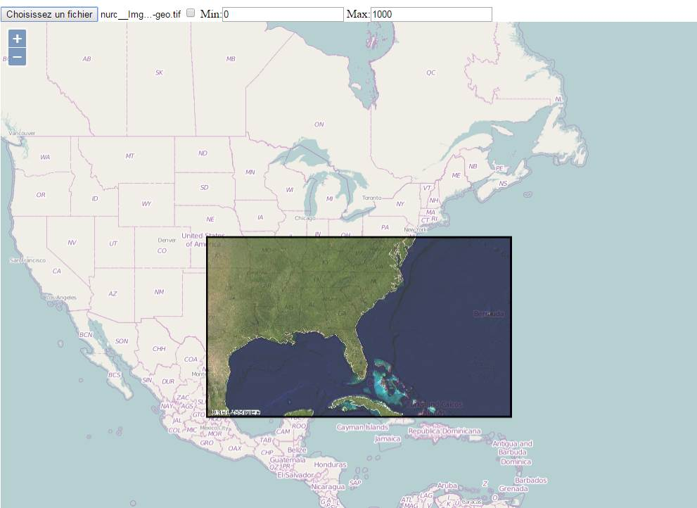

GeotiffParser.js
===============

A JavaScript-based parser for the GeoTIFF image format.
This parser is based on the GPHemsley/tiff-js : canvas part has been removed, but GeoTiff geoKey has been added.
Not all Tiff capacity has been coded. 

What's supported for the Tiff part  
Compression     :   None and Packbits   
Strips / Tiles  :  Supported  
Photometric Interpretation : RGB , GreyScale, BiLevel, RGB, RGB Color Palette 
Planar Configuration :  PLANARCONFIG_CONTIG   
Size  : images should not be to big in order to be loaded properly.

What's supported for the GeoTiff part  
ModelPixelScale : Supported  
ModelTransformation : Supported  
ModelTiepoint : GTIFTiepointTranslate is not implemented   

Some part of the code is a port from LibGeoTiff 1.4.0  
See  http://trac.osgeo.org/geotiff  for geoTiff information 

-----------------------------------------------------------

Why GeotiffParser.js ?

My attempt is to parse GeoTiff files coming from a WCS server (I'm using a Geoserver) in order to do some computation like obtaining the elevation along a path. With GeoTiff client side you could also change dynamically the rendering function. 

-----------------------------------------------------------
GeotiffParser in action with OpenLayers 3 :

